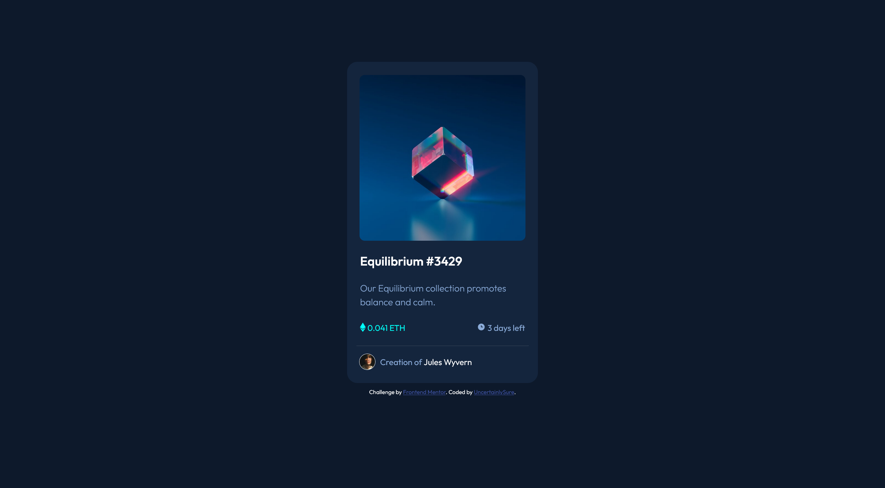

# Frontend Mentor - NFT preview card component solution

This is a solution to the [NFT preview card component challenge on Frontend Mentor](https://www.frontendmentor.io/challenges/nft-preview-card-component-SbdUL_w0U). Frontend Mentor challenges help you improve your coding skills by building realistic projects.

## Table of contents

- [Overview](#overview)
  - [The challenge](#the-challenge)
  - [Screenshot](#screenshot)
  - [Links](#links)
- [My process](#my-process)
  - [Built with](#built-with)
  - [What I learned](#what-i-learned)
  - [Continued development](#continued-development)
  - [Useful resources](#useful-resources)
- [Author](#author)

**Note: Delete this note and update the table of contents based on what sections you keep.**

## Overview

### The challenge

Users should be able to:

- View the optimal layout depending on their device's screen size
- See hover states for interactive elements

### Screenshot



### Links

- Live Site URL: [Add live site URL here](https://your-live-site-url.com)

## My process

### Built with

- Basic HTML5
- Basic CSS3

### What I learned

```html
<body>
  <header>
    <h1>NFT Preview Card Component</h1>
  </header>
  <main>
    <section class="main-picture-section">
      
      <div class="middle-overlay"></div>
      
    </section>
    <p class="main-sentence">Equilibrium #3429</p>
    <p class="nft-description">
      Our Equilibrium collection promotes balance and calm.
    </p>
    <p class="price-eth">
       0.041 ETH
    </p>
    <p class="days-left">
       3 days left
    </p>

    <hr />

    <section class="profile-section">
      
      <p class="creator-section">
        Creation of
        <span>Jules Wyvern</span>
      </p>
    </section>
  </main>

  <footer>
    Challenge by
    <a href="https://www.frontendmentor.io?ref=challenge" target="_blank"
      >Frontend Mentor</a
    >. Coded by
    <a href="https://github.com/UncertainlySure">UncertainlySure</a>.
  </footer>
</body>
```

```css
a:hover {
  color: hsl(178, 100%, 50%);
}

.main-picture-section:hover {
  cursor: pointer;
}

.main-picture-section:hover .middle-overlay {
  opacity: 0.5;
}

.main-picture-section:hover .icon-view-image {
  opacity: 1;
}

.main-sentence:hover,
span:hover {
  color: hsl(178, 100%, 50%);
  cursor: pointer;
}
```

### Continued development

Haven't refactor the code yet. Will do so in the future.

### Useful resources

- [W3Schools](https://www.w3schools.com/default.asp) - This website helped me figure out how to use hover states in new ways.
- [MDN Web Docs](https://www.example.com) - A comprehensive web document detailing every HTML and CSS syntax.

## Author

- Frontend Mentor - [@UncertainlySure](https://www.frontendmentor.io/profile/UncertainlySure)
